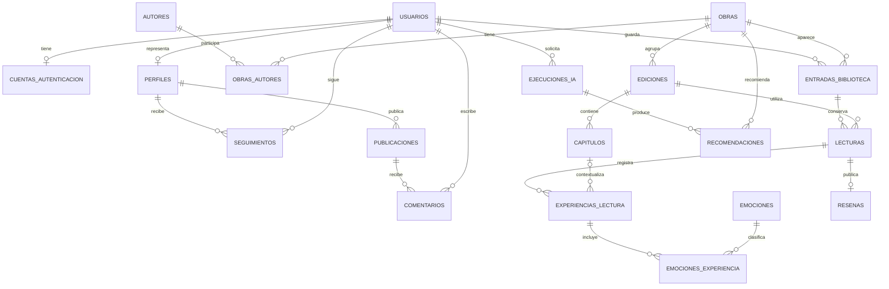

# Modelo de datos de LibrIA

> **Decisión posterior:** el [modelo social acordado](social-model.md) reemplaza las propuestas de este documento sobre identidad pública, reseñas por lectura, publicaciones, comentarios y feed. Las secciones siguientes conservan el diseño histórico hasta que se migre el esquema.

Documento de diseño basado en los requisitos acordados. La primera etapa ya está implementada hasta la migración `0003_catalogo_lecturas`: `app.usuarios`, `app.cuentas_autenticacion`, `app.autores`, `app.obras`, `app.obras_autores`, `app.ediciones`, `app.fuentes_catalogo`, `app.entradas_biblioteca`, `app.lecturas` y `app.progreso_lectura`. Las tablas originales `app.users` y `app.auth_accounts` fueron renombradas mediante la migración 0002. Las demás tablas siguen propuestas. Los vínculos de autores y ediciones a perfiles públicos se agregarán en la etapa social. Consultar la [guía de PostgreSQL y pgAdmin](database.md) para visualizar la base y conocer el alcance implementado.

## Requisitos confirmados

- El progreso se calcula con la página ingresada y el total de páginas de la edición. Los estados son pendiente, leyendo, terminado y abandonado; se registra el motivo del abandono.
- Una persona puede releer una obra sin límite de veces y consultar las experiencias anteriores.
- El catálogo admite importación desde una API y registro manual. Una obra agrupa sus distintas ediciones e idiomas, que permanecen visibles como alternativas.
- Registrar experiencias es opcional, por capítulo o al finalizar el libro. Incluyen valoración de 1 a 5, reseña, emociones, intensidad emocional, conexión con personajes y satisfacción con el final.
- Los perfiles son públicos. Los lectores pueden seguir autores, librerías, editoriales y otros tipos de perfiles por definir. Estos perfiles pueden publicar; los usuarios pueden comentar. Hay reseñas de lectores por libro.
- La IA entrega recomendaciones y análisis de patrones y emociones. Sus resultados se conservan en la base de datos.

## Convenciones

Los nombres de tablas se escriben en español, en minúsculas y con guiones bajos, sin tildes ni ñ (por ejemplo, `resenas`). El diagrama muestra los mismos nombres en mayúsculas. Se conservan los nombres de esquemas `app`, `analytics` y `ai`, así como los campos y valores técnicos actuales en inglés. Los modelos y las migraciones de la primera etapa ya usan esta nomenclatura en PostgreSQL.

Salvo que se indique otra cosa, cada tabla tiene `id UUID` como PK y `created_at TIMESTAMPTZ NOT NULL DEFAULT now()`. Las tablas editables incluyen `updated_at TIMESTAMPTZ`. Las tablas puente usan la PK compuesta indicada y no necesitan `id`. Los campos son obligatorios excepto los marcados con `?` (admiten NULL). Las FK usan UUID. `TEXT` representa texto de longitud variable; los límites de entrada se validarán también en la API.

Las enumeraciones descritas se implementarán con restricciones CHECK o catálogos controlados. Todas las fechas representan instantes con zona horaria. Las FK e índices se crearán explícitamente mediante Alembic. Las reglas que abarcan varias tablas requieren servicio transaccional o trigger; no se asume que un CHECK pueda consultar otra tabla.

## Relaciones principales

El diagrama omite tablas de historial, membresías y analítica para facilitar la lectura; están definidas más abajo.

## 1. Identidad y perfiles

| Tabla | Campos específicos | Restricciones y relaciones |
|---|---|---|
| `app.usuarios` (implementada) | `display_name VARCHAR(100)`, `avatar_url VARCHAR(500)?`, `biography TEXT?`, `updated_at TIMESTAMPTZ` | Perfil personal actual; se conserva. |
| `app.cuentas_autenticacion` (implementada) | `user_id`, `email VARCHAR(320)`, `password_hash VARCHAR(500)` | FK a usuarios, UNIQUE(user_id), email único; borrado de usuario elimina sus credenciales en cascada. |
| `app.perfiles` | `kind TEXT`, `user_id?`, `name TEXT?`, `biography TEXT?`, `avatar_url TEXT?` | kind: reader, author, bookstore, publisher, other. Para reader, user_id obligatorio y único; para los demás, user_id NULL y name obligatorio. |
| `app.miembros_perfil` | `profile_id`, `user_id`, `role TEXT` | PK(profile_id, user_id); FK a perfiles/usuarios; role: owner, editor. Autoriza administrar perfiles no personales. |
| `app.seguimientos` | `follower_user_id`, `target_profile_id` | PK(follower_user_id, target_profile_id); FK a usuarios/perfiles. |

Propuesta: separar la cuenta que inicia sesión del perfil público de un autor u organización. Una misma persona puede administrar una editorial y mantener su perfil lector. Los perfiles personales muestran nombre, biografía y avatar desde usuarios; los campos equivalentes de perfiles quedan NULL para evitar dos fuentes de verdad. Crear un usuario también creará su perfil reader en la futura implementación.

Ser público no expone email, hash, historial de IA ni registros emocionales. Propuesta pendiente de validar: las experiencias son privadas y el usuario decide publicar una reseña. Tampoco se publica automáticamente la biblioteca. Los administradores de un perfil institucional no obtienen acceso a los datos privados de sus seguidores.

## 2. Catálogo: obra, edición y procedencia

| Tabla | Campos específicos | Restricciones y relaciones |
|---|---|---|
| `app.obras` | `title TEXT`, `description TEXT?`, `original_language TEXT?`, `created_by_user_id?` | FK opcional a usuarios; agrupa el contenido literario, independientemente de la edición. |
| `app.autores` | `name TEXT`, `biography TEXT?`, `profile_id?` | FK opcional y única a perfiles de tipo author, validada por servicio. Un autor bibliográfico puede existir sin cuenta ni perfil administrado. |
| `app.obras_autores` | `work_id`, `author_id`, `position INTEGER` | PK(work_id, author_id); FK a obras/autores; position > 0. |
| `app.ediciones` | `work_id`, `title TEXT`, `language TEXT`, `edition_label TEXT?`, `publication_year SMALLINT?`, `isbn13 VARCHAR(13)?`, `page_count INTEGER?`, `description TEXT?`, `cover_url TEXT?`, `publisher_name TEXT?`, `publisher_profile_id?`, `created_by_user_id?` | FK a obras, perfiles y usuarios; ISBN normalizado único cuando existe; page_count > 0 cuando existe. |
| `app.fuentes_catalogo` | `edition_id`, `provider TEXT`, `external_id TEXT`, `fetched_at TIMESTAMPTZ` | FK a ediciones; UNIQUE(provider, external_id). Permite varias fuentes por edición. |
| `app.capitulos` | `edition_id`, `position INTEGER`, `title TEXT?`, `start_page INTEGER?`, `end_page INTEGER?` | FK a ediciones; UNIQUE(edition_id, position); position > 0; páginas positivas y start_page <= end_page si ambas existen. |

Una obra puede tener una edición en español de 300 páginas y otra en inglés de 280. La ficha de la obra lista ambas; el usuario selecciona una para cada lectura. Aquí “páginas” significa páginas numeradas, no hojas físicas. Los capítulos dependen de la edición porque su orden y paginación pueden cambiar.

Si la API no trae el total de páginas, se conserva la edición incompleta, pero no se calcula porcentaje ni se inicia seguimiento por páginas hasta completar ese dato. Nunca se inventa un total. Idioma se guarda como código normalizado; una edición multilingüe requeriría ampliar esta propuesta.

La importación usa la identidad del proveedor y el ISBN para detectar duplicados. No se agrupan obras automáticamente solo por títulos iguales; los casos ambiguos requieren revisión. Propuesta: el alta manual y la corrección del catálogo quedan a cargo de administradores, con autorización en el backend. No se ha elegido proveedor externo.

## 3. Biblioteca, relecturas y avance

| Tabla | Campos específicos | Restricciones y relaciones |
|---|---|---|
| `app.entradas_biblioteca` | `user_id`, `work_id`, `archived_at TIMESTAMPTZ?` | FK a usuarios/obras; UNIQUE(user_id, work_id). Archivar no elimina lecturas anteriores. |
| `app.lecturas` | `library_entry_id`, `work_id`, `edition_id`, `status TEXT`, `current_page INTEGER DEFAULT 0`, `total_pages INTEGER?`, `started_at TIMESTAMPTZ?`, `finished_at TIMESTAMPTZ?`, `abandoned_at TIMESTAMPTZ?`, `abandonment_reason TEXT?` | FK a entradas_biblioteca/ediciones; status: pending, reading, finished, abandoned; current_page >= 0; total_pages > 0 cuando existe; current_page <= total_pages cuando existe. |
| `app.progreso_lectura` | `reading_id`, `page INTEGER`, `recorded_at TIMESTAMPTZ` | FK a lecturas; page >= 0. Historial de actualizaciones de página. |

Cada intento es una fila nueva de lecturas. No hay límite de relecturas ni restricción única sobre (usuario, edición). La edición debe pertenecer a la obra de la entrada de biblioteca; dos claves foráneas compuestas validan esta relación en PostgreSQL usando work_id, tanto contra entradas_biblioteca como contra ediciones. Esa columna adicional permite impedir combinaciones de obras y ediciones incoherentes incluso al insertar desde un administrador de base de datos. La vista de historial muestra todos los intentos y sus experiencias, incluso los abandonados.

Reglas propuestas para el seguimiento:

1. Agregar una obra a la biblioteca crea una lectura pending con la edición elegida, página 0 y sin fecha de inicio.
2. Al iniciar, se copia page_count de la edición a total_pages. Esta copia mantiene estable el cálculo histórico aunque después se corrija el catálogo. Una lectura activa conserva su edición; para cambiarla se necesita una acción explícita que revise páginas y capítulos, nunca una sustitución silenciosa.
3. El porcentaje se deriva: `round(100 * current_page / total_pages, 2)`. Con 75 de 300 páginas se muestra 25 %. No se almacena como un segundo dato modificable. Sin total conocido se muestra “pendiente de paginación”.
4. Para reading, finished o abandoned, total_pages es obligatorio. En pending, current_page = 0. Al comenzar se registra started_at; las fechas de cierre no pueden ser anteriores al inicio.
5. Terminar establece current_page = total_pages y finished_at. Propuesta: llegar a la última página ofrece confirmar la finalización, sin cerrar automáticamente la lectura.
6. Abandonar requiere abandonment_reason no vacío y abandoned_at. Conserva la página alcanzada. Solo abandoned admite motivo y fecha de abandono; solo finished admite finished_at.
7. Cada cambio de página actualiza lecturas y agrega progreso_lectura en la misma transacción. Se permiten correcciones hacia atrás; el registro conserva lo ocurrido y la página no puede superar el total de esa lectura.
8. Releer crea otra fila pending y conserva la anterior. Propuesta: retomar un intento abandonado también crea una nueva lectura; no modifica su motivo ni sus experiencias anteriores.

Los textos de interfaz serán “Pendiente”, “Leyendo”, “Terminado” y “Abandonado”. El estado corresponde a cada lectura, no a la obra global. La biblioteca debe mostrar claramente la lectura seleccionada y ofrecer acceso al historial, incluso cuando haya varias lecturas de la misma obra.

## 4. Experiencias, emociones y reseñas

| Tabla | Campos específicos | Restricciones y relaciones |
|---|---|---|
| `app.experiencias_lectura` | `reading_id`, `scope TEXT`, `chapter_id?`, `rating SMALLINT?`, `review_text TEXT?`, `emotional_intensity SMALLINT?`, `character_connection SMALLINT?`, `ending_satisfaction SMALLINT?` | FK a lecturas/capitulos; scope: chapter, book. Todos los valores numéricos, cuando existen, entre 1 y 5. |
| `app.emociones` | `code TEXT`, `label TEXT`, `active BOOLEAN DEFAULT true` | code único y estable; catálogo compartido por formulario y analítica. |
| `app.emociones_experiencia` | `experience_id`, `emotion_id` | PK(experience_id, emotion_id); FK a experiencias_lectura/emociones. |
| `app.resenas` | `reading_id`, `rating SMALLINT?`, `body TEXT`, `published_at TIMESTAMPTZ`, `hidden_at TIMESTAMPTZ?` | FK única a lecturas; rating entre 1 y 5 cuando existe; body no vacío. |

Registrar una experiencia no es requisito para avanzar, abandonar ni terminar. Propuesta: sus campos también son opcionales; una experiencia guardada debe contener al menos una respuesta o emoción. Esa última regla se valida en una transacción porque incluye la tabla puente.

Para scope=chapter, chapter_id es obligatorio y debe pertenecer a la edición de la lectura. Para scope=book, chapter_id es NULL y la lectura debe estar finished. Propuesta: una experiencia editable por capítulo y lectura, y una experiencia final por lectura, mediante índices únicos parciales. Cada relectura tiene sus propias experiencias; no sobrescribe las de otros intentos. ending_satisfaction se muestra solo en la experiencia final y queda NULL en las de capítulo.

La reseña pública es una publicación explícita, separada de las respuestas privadas. Se puede preparar a partir de review_text y rating, pero guarda su propia copia: editar una experiencia no cambia lo publicado sin una acción del usuario. Cada lectura permite una reseña, de modo que las relecturas pueden aportar nuevas opiniones. Autor, obra y edición se obtienen a través de lecturas y entradas_biblioteca. Propuesta: se permite reseñar una lectura iniciada, terminada o abandonada.

## 5. Publicaciones y comentarios

| Tabla | Campos específicos | Restricciones y relaciones |
|---|---|---|
| `app.publicaciones` | `profile_id`, `created_by_user_id`, `body TEXT`, `published_at TIMESTAMPTZ?`, `hidden_at TIMESTAMPTZ?` | FK a perfiles/usuarios; body no vacío. published_at NULL representa borrador. |
| `app.comentarios` | `post_id`, `user_id`, `body TEXT`, `hidden_at TIMESTAMPTZ?` | FK a publicaciones/usuarios; body no vacío. |

El servicio comprueba que quien publica administra el perfil mediante miembros_perfil. Propuesta inicial: publican perfiles author, bookstore, publisher y other autorizado; los lectores publican sus reseñas. Solo las publicaciones publicadas y visibles aceptan comentarios. Los borradores son visibles únicamente para administradores del perfil.

Los seguimientos apuntan a perfiles, por lo que admiten autores y organizaciones sin inventar FK polimórficas. Propuesta: impedir seguir el propio perfil personal. Las respuestas anidadas, reacciones, comentarios sobre reseñas y archivos adjuntos no están incluidos porque aún no se solicitaron.

## 6. Datos transformados e historial de IA

| Tabla | Campos específicos | Restricciones y relaciones |
|---|---|---|
| `analytics.ejecuciones_etl` | `status TEXT`, `started_at TIMESTAMPTZ`, `finished_at TIMESTAMPTZ?`, `source_cutoff_at TIMESTAMPTZ`, `transform_version TEXT`, `error_code TEXT?` | status: running, succeeded, failed. Registra ejecución y fecha de corte. |
| `analytics.instantaneas_lector` | `user_id`, `etl_run_id`, `period_start TIMESTAMPTZ`, `period_end TIMESTAMPTZ`, `schema_version TEXT`, `metrics JSONB` | FK a app.usuarios y ejecuciones_etl; period_start <= period_end. Instantánea inmutable. |
| `analytics.instantaneas_catalogo` | `etl_run_id`, `schema_version TEXT`, `catalog JSONB` | FK a ejecuciones_etl; catálogo transformado con identificadores de obras y atributos usados para recomendar. Inmutable. |
| `ai.ejecuciones` | `user_id`, `reader_snapshot_id`, `catalog_snapshot_id?`, `kind TEXT`, `status TEXT`, `provider TEXT`, `model TEXT`, `prompt_version TEXT`, `input_payload JSONB`, `output_payload JSONB?`, `started_at TIMESTAMPTZ`, `finished_at TIMESTAMPTZ?`, `error_code TEXT?` | FK a app.usuarios, analytics.instantaneas_lector y analytics.instantaneas_catalogo; kind: recommendations, patterns, emotions, combined; status: pending, running, succeeded, failed. |
| `ai.recomendaciones` | `run_id`, `work_id`, `position INTEGER`, `reason TEXT`, `edition_id?` | FK a ejecuciones, app.obras y app.ediciones; UNIQUE(run_id, position), UNIQUE(run_id, work_id); position > 0. |

El ETL lee app y escribe analytics. FastAPI arma input_payload exclusivamente a partir de instantáneas exitosas de analytics; el proveedor de IA no recibe acceso a las tablas operacionales. El catálogo transformado permite recomendar sin saltarse ese límite. catalog_snapshot_id es obligatorio para recomendaciones y combined.

Contrato inicial propuesto para metrics: cantidad de lecturas por estado, obras terminadas, valoraciones agregadas, distribución de emociones, promedios de las escalas, idiomas y autores leídos, e identificadores de obras leídas. Cada métrica incluye su cantidad de observaciones; ausencia de respuesta no significa cero. Una relectura cuenta como otro intento; las métricas de obras distintas se calculan por work_id. Los porcentajes emocionales deben declarar si su denominador son experiencias o selecciones de emociones.

catalog contiene obras disponibles y sus atributos bibliográficos seleccionados, con ediciones e idiomas. Los JSON tienen contratos validados por Pydantic y versionados; no son estructuras arbitrarias. Propuesta: inicialmente se excluyen textos privados de reseñas y motivos de abandono del envío a IA, usando agregados para analizar emociones.

Cada solicitud crea ai.ejecuciones y conserva resultado, fecha, modelo, versión del prompt y datos de entrada transformados. Los resultados estructurados de patrones y emociones quedan en output_payload; las recomendaciones además se normalizan en ai.recomendaciones. Se valida que las obras recomendadas existan en el catálogo enviado, que una edición recomendada pertenezca a su obra y que el snapshot lector corresponda al solicitante. Un fallo queda registrado sin producir recomendaciones válidas. El historial se consulta por usuario, no es público.

## Integridad, consultas y conservación

- Indexar las FK no cubiertas por PK o UNIQUE; agregar índices de lecturas por (library_entry_id, created_at), progreso por (reading_id, recorded_at), publicaciones por (profile_id, published_at), comentarios por (post_id, created_at) e IA por (user_id, created_at).
- Email conserva la normalización a minúsculas existente; propuesta: reforzar en la base su unicidad sin distinguir mayúsculas. La migración 0003 elimina la restricción redundante original y conserva el índice único de email.
- updated_at existente se actualiza desde SQLAlchemy; no es un trigger de PostgreSQL. Para las tablas nuevas se seguirá inicialmente esa convención.
- Las acciones sobre biblioteca, lectura, experiencias y resultados de IA verifican propiedad a través del usuario autenticado. La API nunca acepta un user_id ajeno como autorización.
- Propuesta: usar RESTRICT para borrar obras, ediciones, capítulos o lecturas referenciadas; archivar u ocultar conserva el historial. Usar CASCADE para puentes dependientes cuando el padre pueda eliminarse. Las FK opcionales de procedencia o atribución pueden usar SET NULL.
- La eliminación de cuentas con datos nuevos requiere un flujo explícito de eliminación o anonimización; no extender automáticamente la cascada de credenciales a reseñas, comentarios, instantáneas e IA. El plazo de conservación y tratamiento de contenido público quedan pendientes de decisión.

## Decisiones propuestas que quedan por validar

El diseño puede revisarse sin modificar la base actual. Quedan como propuestas: privacidad de biblioteca y experiencias, roles de administración del catálogo y perfiles, campos opcionales de cada experiencia, una experiencia editable por capítulo, satisfacción del final solo a nivel de libro, reglas para retomar abandonos, reseñas de lecturas no terminadas, tipos adicionales de perfiles y política de eliminación/conservación. También falta elegir API bibliográfica y proveedor de IA.

## Orden de implementación

1. Obras, autores, ediciones y fuentes del catálogo.
2. Biblioteca, lecturas, cálculo por páginas e historial de progreso.
3. Capítulos, experiencias y catálogo de emociones.
4. Perfiles administrados, reseñas, seguimientos, publicaciones y comentarios.
5. ETL, instantáneas e historial de IA.

Cada etapa necesita sus migraciones, modelos, validaciones y endpoints. Este documento no agrega tablas ni cambia la aplicación por sí mismo.
